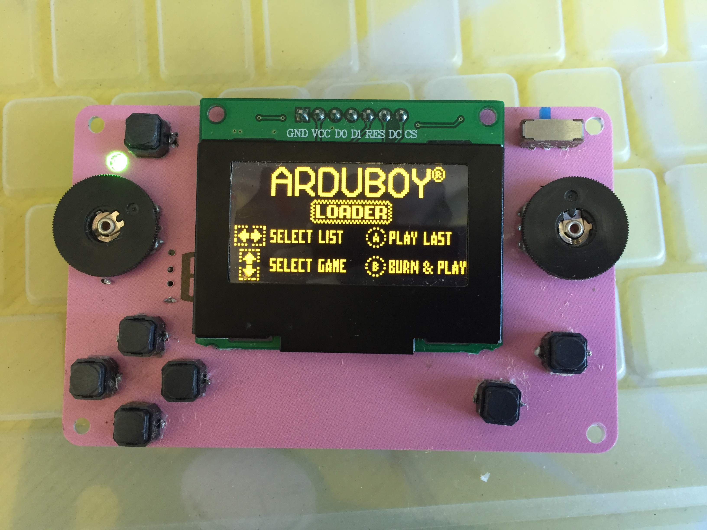
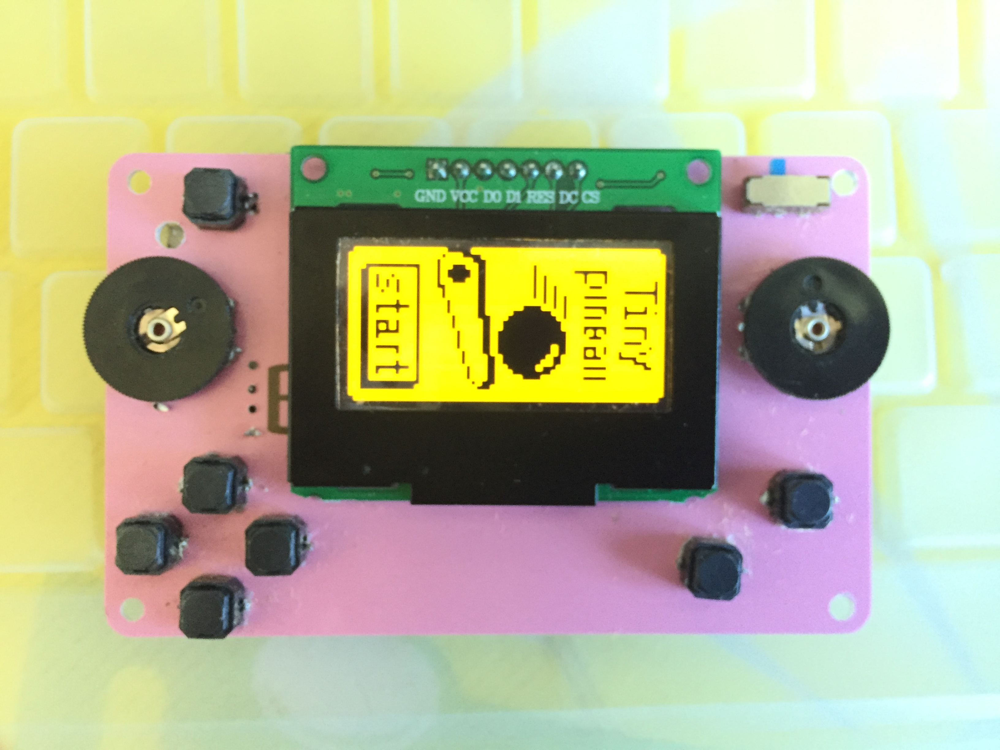

# Credit-Card-Arduboy
Credit Card Arduboy with flashcart
by : chuengbx   2019/12/24
 
This is a Credit Card arduboy that made using a real credit card. smaller than half  of a credit card. 

Parts:
Arduino Pro Micro (or Arduino Micro)
0.9" mono  OLED with SPI interface on SSD1306 controller. The 7 pin male header of the OLED is plugged into the female header.
The OLED chosen must have the 7th pin for CS. Otherwise, it'll conflict with the Flahcart,
causing screen flickering and misalignment when loading games from flashcart or when playing  video stored on the flashcart
16MB serial flash to  load 500+ Arudboy games to be self-programmed to Arduino Micro anytime through the Cathy 3K bootloader
(original circuit, python scripts for game loading, and the Cathy 3K bootloader and homemade arduby package is designed by Mr.Blinky (inks below).
4.2V regulator and battery managemeent module - 5V is taken from the RAW pin of the Arduino Pro Micro (which is sourced from the USB  port).
To allow the board to be powerd off during charging, the onboard regulator need to be removed.
3.7V LiPO Battery is charged by the battery management module that provide charging at 4.2V that also supply  4.2V  to the VCC pin of the Arduino Pro Micro, 
the VCC of the OLED and the  serial flash. 
To use the serial flash for game loading, the Cathy 3K boot loader must be burnt to the Pro Micro using USBasp.
 
Credits and References to original authors of Arduboy and Flashcart:
 
1. Original Arduboy production schametics:  
    https://community.arduboy.com/t/production-arduboy-schematic/702
 
2. MR.Blinky's original design of flashcart: 
    https://github.com/MrBlinky/Arduboy/tree/master/flashcart
 
3. MR. Blinky;s GITHUB with python scripts and sample flash cart image binaries for sample games :
    https://github.com/MrBlinky/Arduboy-Python-Utilities
 
4. MR. Blinky's homemade package (required to operate the flash cart with alternate wiring and different types of OLED other than the  SSD1306 used in original Arduboy:
    https://github.com/MrBlinky/Arduboy-homemade-package
